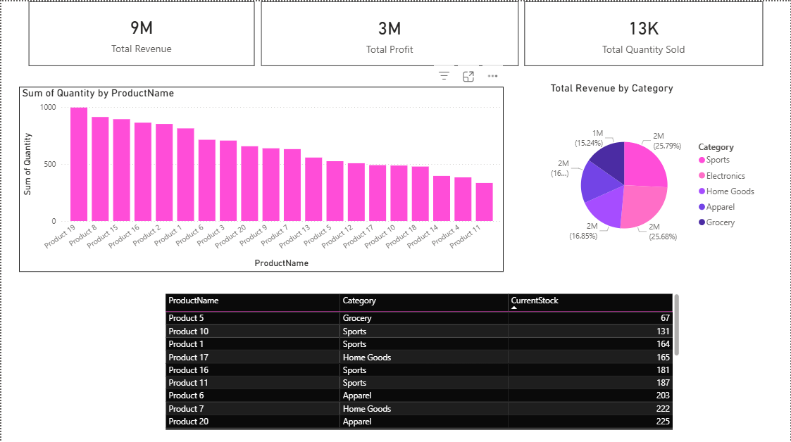

# Power BI Sales & Inventory Dashboard

This project contains a Power BI dashboard built on a synthetic dataset of ~200 sales transactions and inventory records.

## Dataset

- **File:** `Sales_Inventory_Data.xlsx`
- Sheets:
  - `Products` – product details (ID, name, category, cost, selling price)
  - `Sales` – transactional sales data (product, quantity, date)
  - `Inventory` – current stock level by product

## Dashboard (Power BI)

- **File:** `PowerBI_Sales_Inventory.pbix`
- Key visuals:
  - KPI cards: Total Revenue, Total Profit, Total Quantity Sold
  - Bar chart: Product-wise sales quantity
  - Pie chart: Category-wise revenue contribution
  - Table: Product-wise inventory with stock levels

## Objective

- Analyze product performance
- Track revenue and profit
- Monitor low stock items using a simple and interactive dashboard

## Screenshot

---

Created by: **Shilpa Koley**
